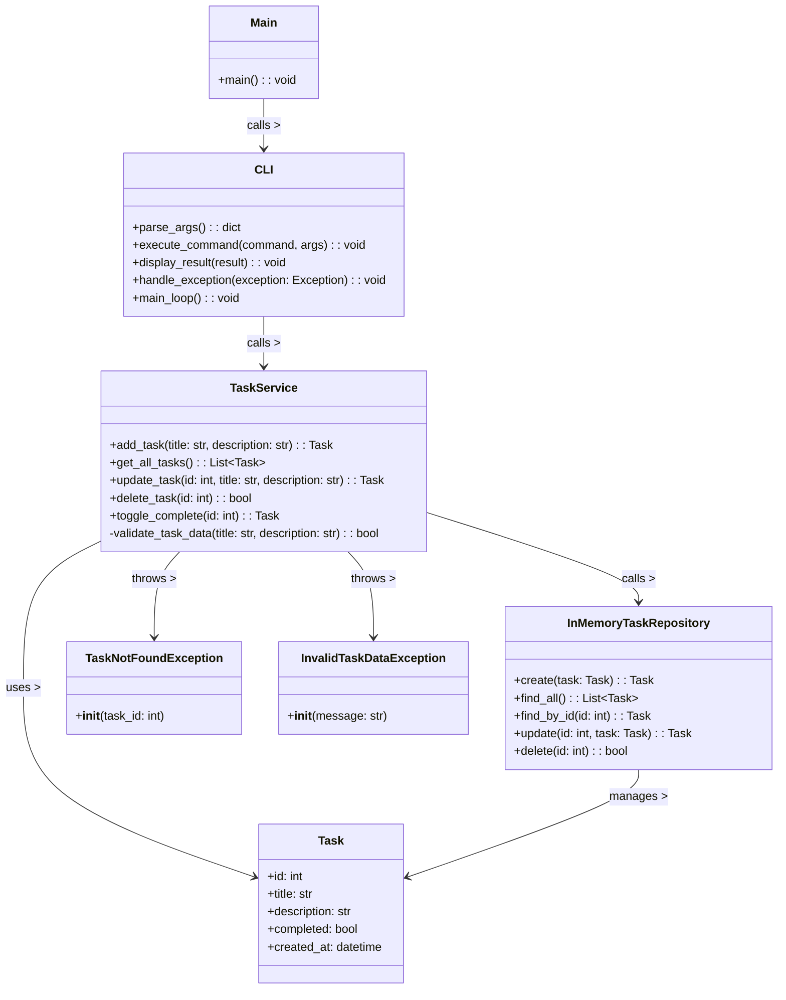

# Implementation Plan: Phase I Console App

**Branch**: `2-phase-1-console` | **Date**: 2026-01-16 | **Spec**: specs/1-specify/features/feature-01-task-crud.md
**Input**: Feature specification from `/specs/1-specify/features/feature-01-task-crud.md`

## Summary

This plan defines the technical architecture for the Phase I Console App, implementing the Task CRUD functionality with a layered architecture. The design follows Clean Architecture principles to ensure modularity and maintainability, making it easier to transition to a web-based interface in Phase II.

## Technical Context

**Language/Version**: Python 3.13
**Primary Dependencies**: Pydantic (for data models), argparse (for CLI parsing), pytest (for testing)
**Storage**: In-memory (Python Lists/Dictionaries) - no external database
**Testing**: pytest with coverage reporting
**Target Platform**: Cross-platform (Linux, macOS, Windows) console application
**Project Type**: Single console application with layered architecture
**Performance Goals**: Response time < 100ms for all operations
**Constraints**: < 100MB memory usage, < 1s startup time, no persistence across sessions
**Scale/Scope**: Single-user, up to 1000 tasks in memory
**Exception Handling**: Custom exception classes for domain-specific errors
**Datetime Handling**: Use UTC timezone for all timestamps via datetime.utcnow()
**Input Sanitization**: Escape special characters and validate input against allowed patterns using Pydantic validation
**Success/Error Messages**: Standardized format with [SUCCESS] or [ERROR] prefix

## Constitution Check

*GATE: Must pass before Phase 0 research. Re-check after Phase 1 design.*

- [x] Spec-Driven Development: All code will be generated from specifications
- [x] Traceability: Every implementation will map back to specification requirements
- [x] No manual coding: Code will be generated via Qwen CLI based on approved tasks
- [x] Task ID referencing: Every file will include header comment with Task ID
- [x] Clean Architecture: Following layered architecture pattern (Presentation -> Service -> Repository)
- [x] Technology Stack: Using Python 3.13, Pydantic, argparse as specified
- [x] Performance: Meeting response time requirements (< 100ms for operations)

## Architecture Overview

The architecture follows a layered approach with clear separation of concerns:



**Pattern**: Layered Architecture (Presentation -> Service -> Repository)
**Reasoning**: To decouple the CLI from the business logic, making it easier to swap the CLI for a Web API in Phase II.

## Component Design (The "Blueprints")

### Models: `Task`
- **Class**: `Task` (using Pydantic BaseModel)
- **Responsibilities**: Represent the core domain entity with validation
- **Fields**:
  - `id: int` - Unique identifier for the task
  - `title: str` - Required title (1-200 characters)
  - `description: str` - Optional description (0-500 characters)
  - `completed: bool` - Completion status (default: False)
  - `created_at: datetime` - Creation timestamp (UTC timezone)

### Custom Exceptions
- **Class**: `TaskNotFoundException(TaskException)`
  - **Constructor**: `__init__(self, task_id: int)`
  - **Message**: "Task with ID {task_id} not found"
  - **Usage**: Raised when a requested task ID does not exist
- **Class**: `InvalidTaskDataException(TaskException)`
  - **Constructor**: `__init__(self, message: str)`
  - **Message**: Custom error message about invalid data
  - **Usage**: Raised when task data fails validation
- **Class**: `TaskException(Exception)`
  - **Base class**: Base exception for all task-related errors
  - **Usage**: Parent class for all custom task exceptions

### Repository: `InMemoryTaskRepository`
- **Class**: `InMemoryTaskRepository`
- **Responsibilities**: Handle all data operations using in-memory storage
- **Methods**:
  - `create(task: Task) -> Task`: Add a new task to storage, returns the created task
  - `find_all() -> List[Task]`: Retrieve all tasks, returns empty list if none exist
  - `find_by_id(id: int) -> Task`: Find a task by ID, raises `TaskNotFoundException` if not found
  - `update(id: int, task: Task) -> Task`: Update an existing task, raises `TaskNotFoundException` if ID not found
  - `delete(id: int) -> bool`: Remove a task by ID, returns True if successful, raises `TaskNotFoundException` if ID not found
- **Storage**: Internal `List[Task]` for data persistence during session
- **ID Generation**: Auto-increment integer ID starting from 1

### Service: `TaskService`
- **Class**: `TaskService`
- **Dependencies**: `InMemoryTaskRepository`
- **Responsibilities**: Handle business logic, validation, and error handling
- **Methods**:
  - `add_task(title: str, description: str) -> Task`: Create a new task with validation, returns the created task
  - `get_all_tasks() -> List[Task]`: Retrieve all tasks, returns empty list if none exist
  - `update_task(id: int, title: str, description: str) -> Task`: Update task details with validation, returns updated task
  - `delete_task(id: int) -> bool`: Delete a task, returns True if successful
  - `toggle_complete(id: int) -> Task`: Toggle completion status, returns updated task
- **Validation**: Enforce title/description length requirements (delegates to model validation)
- **Error Handling**: Throw custom exceptions for domain-specific errors
- **Datetime Handling**: Use `datetime.utcnow()` for all timestamps

### Interface: `CLI`
- **Class**: `CLI`
- **Dependencies**: `TaskService`
- **Responsibilities**: Parse command-line arguments, handle exceptions, and call service methods
- **Methods**:
  - `parse_args() -> dict`: Parse command-line arguments using argparse to identify the command and parameters
  - `execute_command(command: str, args: dict) -> Any`: Execute the appropriate service method based on command
  - `display_result(result: Any) -> None`: Format and display the result to the user
  - `handle_exception(exception: Exception) -> None`: Convert exceptions to appropriate error messages
  - `main_loop() -> None`: Handle the interactive command loop until 'exit' command
- **Parsing**: Use argparse to handle commands like `add`, `view`, `update`, `delete`, `complete`, `exit`
- **Error Handling**: Catch custom exceptions and display appropriate error messages to user
- **Success Messages**: Format with `[SUCCESS]` prefix and include relevant details
- **Error Messages**: Format with `[ERROR]` prefix and match exact strings from spec

### Main Application: `main.py`
- **Function**: `main() -> None`
- **Responsibilities**: Initialize all components and start the CLI main loop
- **Initialization**: Creates repository, service, and CLI instances
- **Execution**: Calls CLI's main_loop() method to start the application

## Data Flow

The data flow follows this sequence when processing a command like "add 'Buy Milk'":

1. **main.py**: Entry point creates all components and calls CLI.main_loop()
2. **CLI.main_loop()**: Continuously prompts user for input and parses commands
3. **CLI.parse_args()**: Parses the user input using argparse to identify the command and parameters
4. **CLI.execute_command()**: Routes the command to the appropriate service method
5. **TaskService.add_task()**: Validates the input data and performs business logic
6. **InMemoryTaskRepository.create()**: Performs the actual data operation (create task)
7. **Return**: Result flows back through the layers to CLI.display_result() for user output

## File Structure (Plan vs Actual)

Mapping the architecture to the `src/` directory:

```text
src/
├── models/
│   └── task.py
├── repositories/
│   └── task_repository.py
├── services/
│   └── task_service.py
├── cli/
│   └── interface.py
└── main.py
```

### File Descriptions:
- `src/models/task.py`: Contains the Task Pydantic model with validation and custom exceptions
- `src/repositories/task_repository.py`: Implements InMemoryTaskRepository with CRUD operations
- `src/services/task_service.py`: Implements TaskService with business logic and validation
- `src/cli/interface.py`: Implements CLI class for parsing and executing commands with main loop
- `src/main.py`: Application entry point that orchestrates the components

## Project Structure

### Documentation (this feature)

```text
specs/2-plan/
├── phase-1-console.md              # This file (implementation plan)
├── research.md                     # Phase 0 output (research and decisions)
├── data-model.md                   # Phase 1 output (entity definitions)
├── quickstart.md                   # Phase 1 output (setup instructions)
├── contracts/                      # Phase 1 output (API contracts)
└── tasks.md                        # Phase 2 output (implementation tasks)
```

### Source Code (repository root)

```text
evolution-of-todo-list-01/
├── src/
│   ├── models/
│   │   └── task.py
│   ├── repositories/
│   │   └── task_repository.py
│   ├── services/
│   │   └── task_service.py
│   ├── cli/
│   │   └── interface.py
│   └── main.py
├── tests/
│   ├── unit/
│   │   ├── models/
│   │   ├── repositories/
│   │   ├── services/
│   │   └── cli/
│   ├── integration/
│   └── conftest.py
├── pyproject.toml
├── uv.lock
└── README.md
```

**Structure Decision**: Single project structure chosen as this is a console application with layered architecture. The clean separation of concerns allows for easy expansion to web interface in Phase II.

## Phase 0: Research & Unknown Resolution

### Research Tasks Completed

#### Decision: Python Version Selection
- **Rationale**: Python 3.13 offers latest features and performance improvements, aligning with project requirements
- **Alternatives considered**: Python 3.11, 3.12 - chose 3.13 for newest features and performance

#### Decision: Data Model Library
- **Rationale**: Pydantic provides excellent validation, serialization, and type hints, fitting well with the clean architecture
- **Alternatives considered**: dataclasses, attrs - chose Pydantic for superior validation capabilities

#### Decision: CLI Parsing Library
- **Rationale**: argparse is part of Python standard library, well-documented, and feature-rich
- **Alternatives considered**: click, typer - chose argparse for simplicity and standard library inclusion

#### Decision: Testing Framework
- **Rationale**: pytest is the de facto standard for Python testing, with excellent plugin ecosystem
- **Alternatives considered**: unittest, nose - chose pytest for ease of use and advanced features

## Phase 1: Design Artifacts

### Data Model: Task Entity

The Task entity represents the core domain object with validation rules:

```python
from pydantic import BaseModel, field_validator
from datetime import datetime
from typing import Optional

class Task(BaseModel):
    id: int
    title: str
    description: Optional[str] = None
    completed: bool = False
    created_at: datetime = datetime.utcnow()

    @field_validator('title')
    def validate_title(cls, v):
        if len(v) < 1 or len(v) > 200:
            raise ValueError('Title must be between 1 and 200 characters')
        return v

    @field_validator('description')
    def validate_description(cls, v):
        if v and len(v) > 500:
            raise ValueError('Description must not exceed 500 characters')
        return v
```

### Custom Exception Classes

The application will use these custom exception classes:

```python
class TaskException(Exception):
    """Base exception class for all task-related errors"""
    pass

class TaskNotFoundException(TaskException):
    """Raised when a requested task ID does not exist"""
    def __init__(self, task_id: int):
        self.task_id = task_id
        super().__init__(f"Task with ID {task_id} not found")

class InvalidTaskDataException(TaskException):
    """Raised when task data fails validation"""
    def __init__(self, message: str):
        self.message = message
        super().__init__(message)
```

### API Contracts (CLI Commands)

The CLI will support the following commands based on functional requirements:

1. `add "title" "optional description"` - Add a new task
2. `view` - Display all tasks
3. `update <id> "title" "optional description"` - Update a task
4. `delete <id>` - Delete a task
5. `complete <id>` - Toggle completion status
6. `exit` - Exit the application

### Success and Error Message Formats

The application will use these standardized message formats:

**Success Messages:**
- `[SUCCESS] Task {id} "{title}" created.` (for add)
- `[SUCCESS] Task {id} marked as complete.` (for complete)
- `[SUCCESS] Task {id} updated.` (for update)
- `[SUCCESS] Task {id} deleted.` (for delete)

**Error Messages:**
- `[ERROR] Title cannot be empty`
- `[ERROR] Title exceeds 200 character limit`
- `[ERROR] Description exceeds 500 character limit`
- `[ERROR] Task ID not found`
- `[ERROR] Invalid command`

### Quickstart Guide

1. Clone the repository
2. Install dependencies with `uv sync`
3. Run the application with `python src/main.py`
4. Use the CLI commands to manage tasks

## Technology Stack Specifications

- **Language**: Python 3.13+
- **Package Manager**: uv
- **Data Modeling**: Pydantic
- **CLI Parsing**: argparse (standard library)
- **Testing**: pytest
- **Architecture**: Clean/Layered Architecture
- **Storage**: In-memory (Python Lists/Dictionaries)

## Complexity Tracking

> **Fill ONLY if Constitution Check has violations that must be justified**

| Violation | Why Needed | Simpler Alternative Rejected Because |
|-----------|------------|-------------------------------------|
| N/A | N/A | N/A |